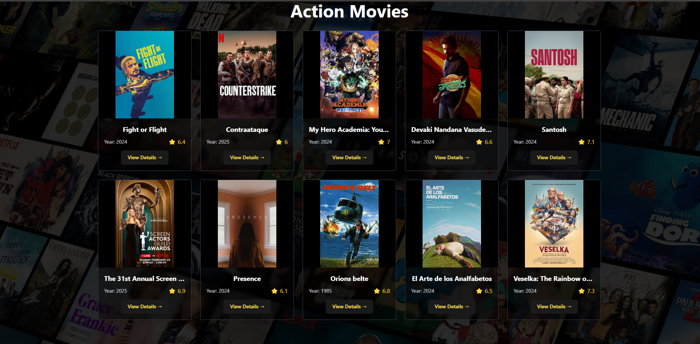
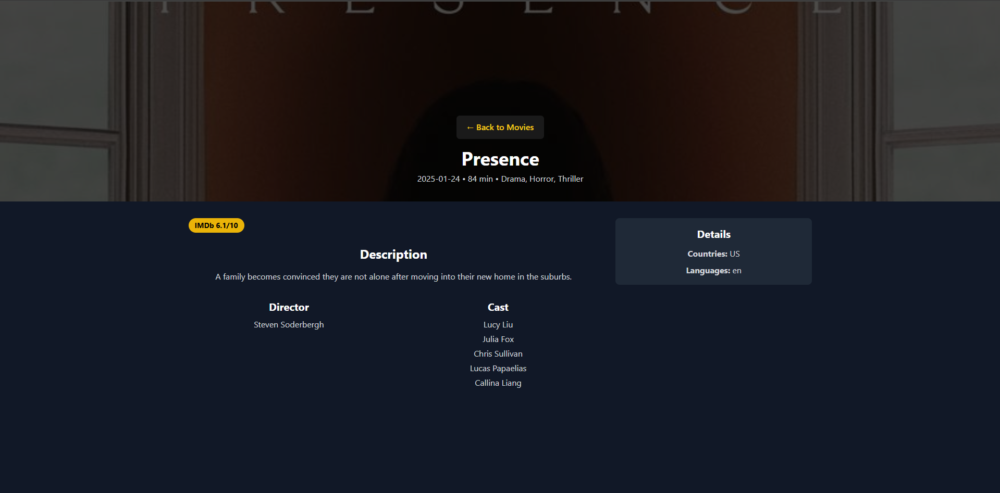

# React + Vite

This template provides a minimal setup to get React working in Vite with HMR and some ESLint rules.

Currently, two official plugins are available:

- [@vitejs/plugin-react](https://github.com/vitejs/vite-plugin-react/blob/main/packages/plugin-react/README.md) uses [Babel](https://babeljs.io/) for Fast Refresh
- [@vitejs/plugin-react-swc](https://github.com/vitejs/vite-plugin-react-swc) uses [SWC](https://swc.rs/) for Fast Refresh

# Movie-Recommendation-Application

I have made a Movie recomandation Application using react that recomand a movie based on the  category. I  have use a rapid api for a recomandation for the recomandation.

If you are facing problem while fetching images you have to use VPN.

1. first you neeed to select category for movie and then minimum rating for the category and then click on the give recommendation button.
   
    
2. After that on the second page api recommends 10 movies of selected category and minimum rating.
   
 

3. To see the details of any movie  click  on the view details button and it shows the details like release year, rating , watch time, language, country, director, description and cast.

 

     
